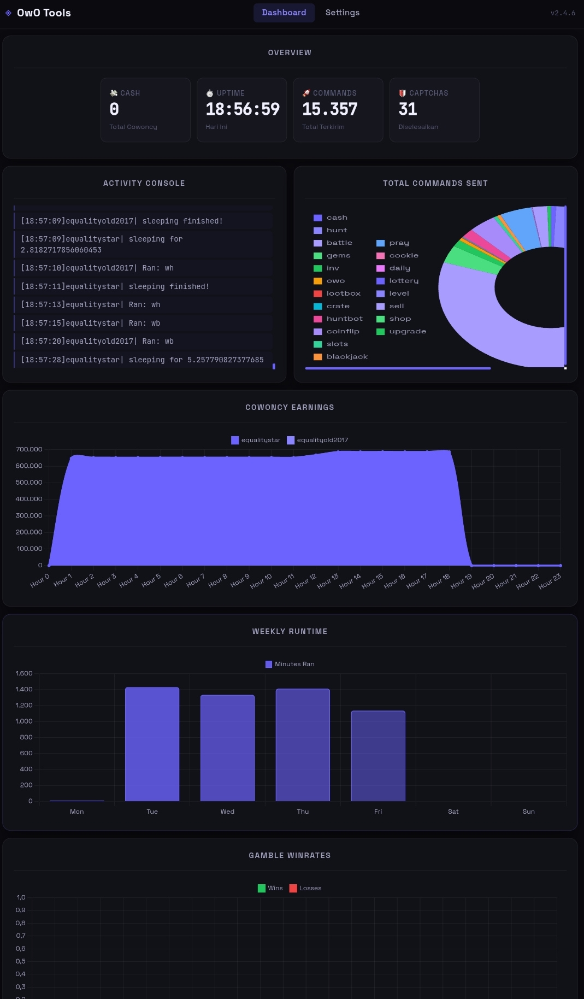
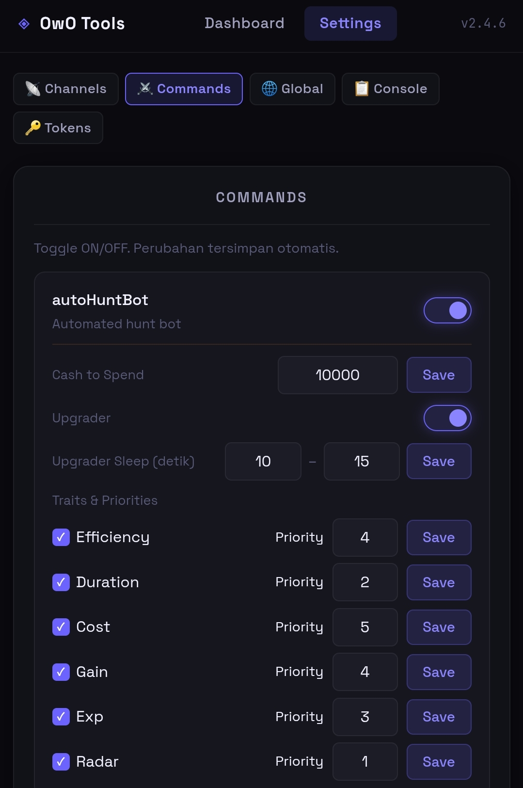
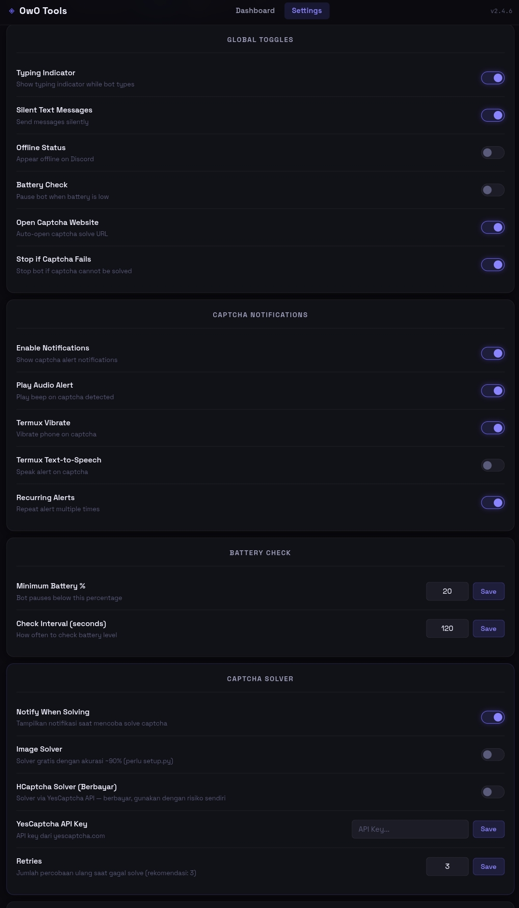
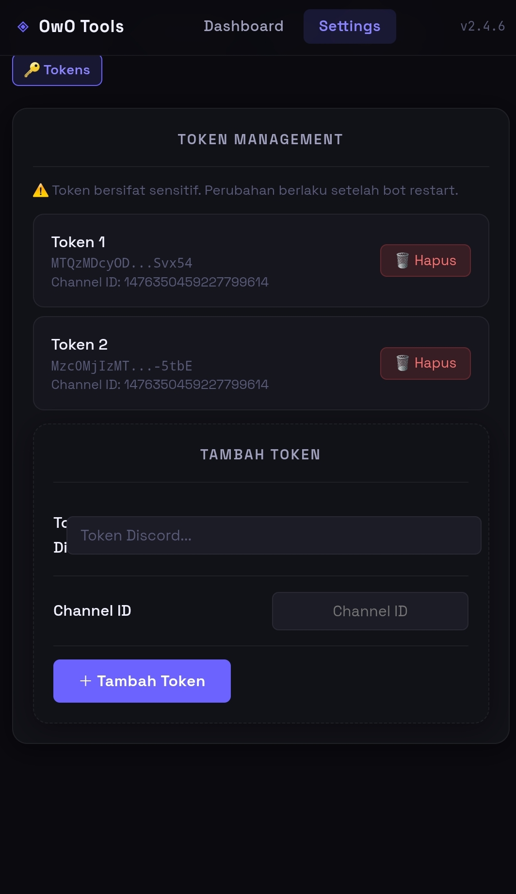

<div align="center">

# ⚙ OwO Tools
**Bot Discord selfbot dengan web dashboard steampunk untuk mengelola OwO Bot secara otomatis.**

[](https://github.com/EqualityDev/Tools-farm/stargazers)
[](LICENSE)
[](https://python.org)

> ⚠️ **Disclaimer:** Proyek ini menggunakan selfbot Discord. Penggunaan selfbot melanggar Terms of Service Discord dan OwO Bot. Gunakan dengan risiko sendiri.

</div>

---

## 🚀 Instalasi Cepat (Termux)

**1 perintah, semua otomatis:**

```bash
curl -sL https://raw.githubusercontent.com/EqualityDev/Tools-farm/main/install.sh | bash
```

Atau manual:

```bash
pkg update && pkg upgrade -y && pkg install python git termux-api -y && termux-setup-storage && cd /storage/emulated/0 && git clone https://github.com/EqualityDev/Tools-farm.git && cd Tools-farm && python3 setup.py && bash run.sh
```

> Pastikan **Termux** dan **Termux:API** sudah terinstall dari F-Droid atau GitHub. Berikan permission **Notifications** ke Termux:API.

---

## 🖥️ Instalasi PC/Linux

```bash
git clone https://github.com/EqualityDev/Tools-farm.git
cd Tools-farm
python3 setup.py
bash run.sh
```

---

## ⚙️ Setup Setelah Install

### 1. Masukkan Token Discord
Edit file `tokens.txt`:
```
nano /storage/emulated/0/Tools-farm/tokens.txt
```
Format (satu baris per akun):
```
TOKEN_DISCORD_1 CHANNEL_ID_1
TOKEN_DISCORD_2 CHANNEL_ID_2
```

### 2. Setup Global Settings (wajib)
Salin contoh konfigurasi:
```bash
cp config/global_settings.example.json config/global_settings.json
```
Edit password/fitur sesuai kebutuhan:
```bash
nano config/global_settings.json
```

### 3. Jalankan Bot
```bash
cd /storage/emulated/0/Tools-farm && bash run.sh
```

### 4. Buka Dashboard
Buka browser dan akses:
```
http://localhost:1200
```
Password default: `owo123` (ubah di `config/global_settings.json`)

### 5. Install sebagai App (PWA)
Di Chrome → ketuk **3 titik** → **Add to Home screen** → icon OwO Tools muncul di home screen!

---

## 🔄 Update Bot

```bash
cd /storage/emulated/0/Tools-farm && python3 updater.py
```
Config dan token otomatis preserved setelah update.

---

## ✨ Fitur

### 📊 Dashboard
- Tema **Steampunk Gaming** — copper, gold, dark
- Overview: cowoncy, uptime, total commands, captchas
- Charts: cowoncy earnings, weekly runtime, gamble winrates, command stats
- Live activity console
- **PWA** — install sebagai app di home screen Android

### ⚔️ Commands (real-time, tanpa restart)
- Toggle ON/OFF setiap command
- Edit cooldown, rarity, user ID target
- autoHuntBot: upgrader traits & priorities
- Gem settings: tiers, jenis gem

### 🎰 Gambling
- Toggle coinflip, slots, blackjack
- Edit nilai, multiplier, cooldown

### 🌐 Global Settings
- Typing indicator, offline status, battery check
- Captcha notifications (vibrate, TTS, audio)
- Captcha solver (image solver gratis + hCaptcha berbayar)

### 📡 Webhook Discord
- Notifikasi captcha ke channel Discord
- Log hewan berdasarkan rarity
- Ping user saat captcha muncul

### 🔑 Token Management
- Tambah/hapus token dari dashboard
- Token tersensor untuk keamanan

### ⚙️ Misc
- Host mode (untuk VPS/server)
- Debug & console settings

### 🧠 Meta Optimizer (`cogs/meta.py`)
Auto team optimizer dan weapon manager untuk battle OwO. Menggunakan [NeonUtil](https://neonutil.com) API untuk stats animal.

Ketik di channel bot (dari akun sendiri):

| Perintah | Fungsi |
|----------|--------|
| `meta scan` | Scan zoo → fetch stats semua animal via `neonutil.com/zoo-stats` → rekomendasi team terbaik (Attacker/Support/Tank) |
| `meta apply` | Terapkan rekomendasi ke team otomatis (remove → add per slot, tunggu response OwO) |
| `meta weapons` | Scan full weapon inventory semua halaman via WebSocket intercept + Discord Interactions API |
| `meta weapon apply` | Auto-equip weapon terbaik ke tiap slot berdasarkan passive scoring |
| `meta template` | Ambil template meta team dari NeonUtil (contoh: rstaff_pruption) |

**Alur penggunaan:**
```
meta scan         → lihat rekomendasi team
meta apply        → terapkan team
meta weapons      → scan semua weapon
meta weapon apply → equip weapon terbaik
```

---

## 🤖 Kontrol via Discord

Kirim pesan di channel bot:

| Perintah | Fungsi |
|----------|--------|
| `.stop` | Pause bot |
| `.start` | Resume bot |
| `.restart_captcha` | Restart setelah captcha |

---

## 📱 Platform

| Platform | Status |
|----------|--------|
| Termux (Android) | ✅ Didukung penuh |
| Linux | ✅ Didukung |
| Windows | ⚠️ Belum ditest |
| macOS | ⚠️ Belum ditest |

---

## 📸 Screenshots

<div align="center">

### Dashboard



### Commands Settings



### Global Settings



### Token Management



</div>

---

## 🙏 Credits

- Bot original: [owo-dusk](https://github.com/owo-dusk/owo-dusk) by **EchoQuill**
- Dashboard & modifikasi: **EqualityDev**

---

## 📄 Lisensi

Berdasarkan [owo-dusk](https://github.com/owo-dusk/owo-dusk) — **GNU GPL v3.0**
