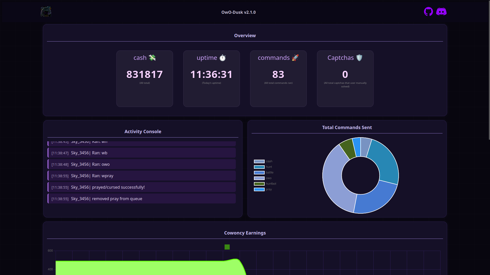

# ⚙ OwO Tools

Dashboard web untuk mengelola dan mengontrol bot Discord **OwO-Dusk** secara real-time melalui browser, tanpa perlu menyentuh file konfigurasi secara manual.

> ⚠️ **Disclaimer:** Proyek ini menggunakan selfbot Discord. Penggunaan selfbot melanggar Terms of Service Discord. Gunakan dengan risiko sendiri.

---

## ✨ Fitur

### 🌐 Web Dashboard
- Akses melalui browser di `http://localhost:1200`
- Tema **Steampunk Gaming** yang keren
- Tidak perlu install aplikasi tambahan — berjalan langsung di Termux

### ⚔️ Kontrol Command
- Toggle ON/OFF setiap command secara real-time
- Edit cooldown min-max per command
- Edit rarity untuk sell/sac
- Edit user ID target untuk pray/curse/cookie
- Edit item shop, lottery amount, huntbot priorities

### 🎰 Kontrol Gambling
- Toggle ON/OFF coinflip, slots, blackjack
- Edit start value, multiplier on lose, cooldown per game
- Edit allotted amount

### 🌐 Global Settings
- Toggle typing indicator, offline status, battery check
- Konfigurasi captcha notifications (vibrate, TTS, audio)
- Konfigurasi captcha solver (image solver & hcaptcha)

### 📡 Channels & Webhook
- Edit webhook URL dan toggle webhook
- Kelola channel switcher per user

### 📋 Console Logs
- Live log aktivitas bot, auto-refresh tiap 5 detik

### 🔄 Restart Bot
- Tombol restart bot langsung dari dashboard tanpa masuk Termux

---

## 📱 Platform

| Platform | Status |
|----------|--------|
| Termux (Android) | ✅ Didukung penuh |
| Linux | ✅ Didukung |
| Windows | ⚠️ Belum ditest |
| macOS | ⚠️ Belum ditest |

---

## 🚀 Instalasi

### 1. Clone repository
```bash
git clone https://github.com/EqualityDev/Tools-farm.git
cd Tools-farm
```

### 2. Jalankan setup
```bash
python setup.py
```
Setup akan otomatis menginstall semua dependencies yang dibutuhkan.

### 3. Konfigurasi
Edit file konfigurasi sesuai kebutuhan:
- `config/settings.json` — konfigurasi per command
- `config/global_settings.json` — konfigurasi global
- `config/captcha.toml` — konfigurasi captcha solver
- `tokens.txt` — token Discord dan channel ID

Format `tokens.txt`:
```
TOKEN_DISCORD CHANNEL_ID
```

### 4. Jalankan bot
```bash
bash run.sh
```

---

## 🌐 Akses Dashboard

Setelah bot berjalan, buka browser dan akses:
```
http://localhost:1200
```

Password default ada di `config/global_settings.json` pada key `website.password`.

---

## 📁 Struktur Project

```
Tools-farm/
├── uwu.py                  # File utama bot + Flask API
├── run.sh                  # Script auto-restart wrapper
├── setup.py                # Script instalasi
├── config/
│   ├── settings.json       # Konfigurasi per-command
│   ├── global_settings.json # Konfigurasi global
│   ├── misc.json           # Alias command
│   └── captcha.toml        # Konfigurasi captcha solver
├── cogs/                   # Fitur bot (24 cogs)
├── templates/
│   ├── index.html          # Halaman utama dashboard
│   └── settings.html       # Halaman settings
├── static/
│   ├── style.css           # CSS tema steampunk
│   ├── script.js           # JS halaman utama
│   └── settings.js         # JS halaman settings
└── utils/                  # Utility functions
```

---

## ⚙️ Stack Teknologi

- **Python 3.12**
- **discord.py-self** — selfbot library
- **Flask** — web dashboard
- **SQLite** — database statistik
- **Chart.js** — visualisasi data
- **Termux** — Android terminal

---

## 🔒 Keamanan

- Dashboard dilindungi password
- Password dikonfigurasi di `config/global_settings.json`
- **Jangan** commit `tokens.txt` ke repository publik
- **Jangan** commit `config/global_settings.json` ke repository publik

---

## 📊 Screenshots

| Dashboard | Settings |
|-----------|----------|
|  | *(Settings page)* |

---

## 🙏 Credits

- Bot original: [owo-dusk](https://github.com/echoquill/owo-dusk) by **EchoQuill**
- Dashboard & modifikasi: **EqualityDev**

---

## 📄 Lisensi

Project ini berdasarkan [owo-dusk](https://github.com/echoquill/owo-dusk) yang dilisensikan di bawah **GNU GPL v3.0**.
